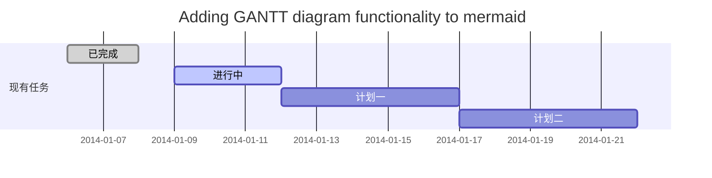
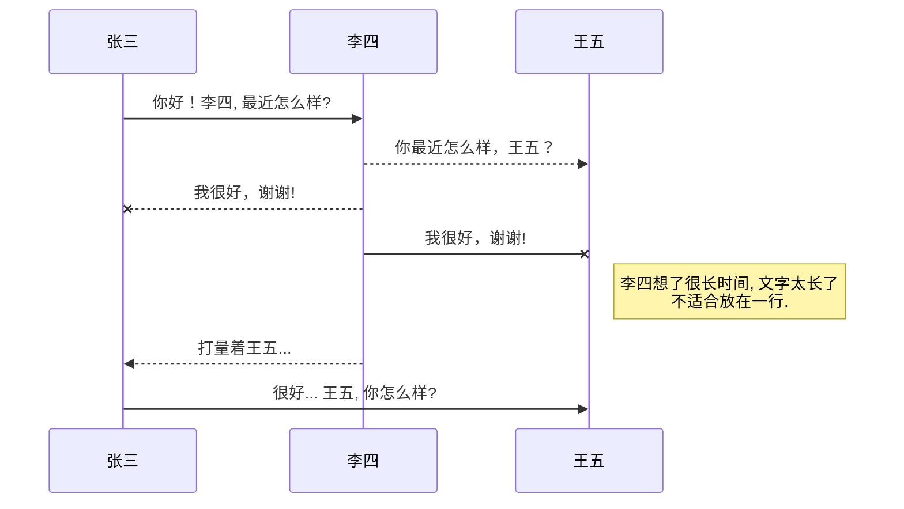
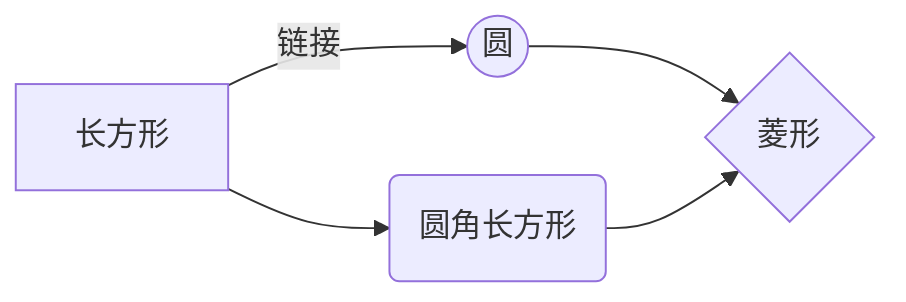

# 概述
Markdown 的目标是实现「易读易写」。
Markdown 的语法全由一些符号所组成，这些符号经过精挑细选，其作用一目了然。比如：在文字两旁加上星号，看起来就像*强调*。Markdown 的列表看起来，嗯，就是列表。Markdown 的区块引用看起来就真的像是引用一段文字，就像你曾在电子邮件中见过的那样。
# 1.快捷键
| **功能**          |  **快捷键**       |
|:------------:|:-------------:|
| 加粗         | Ctrl+B |  
| 斜体         | Ctrl+I |  
| 引用         | Ctrl+Q |  
| 插入链接         | Ctrl+L |  
| 插入代码         | Ctrl+K |  
| 插入图片         | Ctrl+G |  
| 提升标题         | Ctrl+H |  
| 有序列表         | Ctrl+O |  
| 无序列表         | Ctrl+U |  
| 横线         | Ctrl+R |
| 撤销         | Ctrl+Z |
| 重做         | Ctrl+Y |
# 2.基本语法
## 2.1 字体设置斜体、粗体、删除线
`这里是正常文字 -->>       ` 这里是正常文字            
`**这里是加粗文字** -->>   `**这里是加粗文字**       
`*这里是倾斜文字* -->>     `*这里是倾斜文字*
`_这里是倾斜文字_ -->>     `_这里是倾斜文字_
`***这里是加粗倾斜文字*** -->> `***这里是加粗倾斜文字***
`~~这里是中划线文字~~ -->>  `~~这里是中划线文字~~
## 2.2分级标题
### 写法1
`# 一级标题，## 二级标题，### 三级标题，#### 四级标题，##### 五级标题，###### 六级标题`
### 写法2
这是一个一级标题
`=========================`
或者
二级标题
`-------------------------`
## 2.3链接
1.插入本地图片链接
``
这样子需要把图片放到public中本篇博文index.html同级目录。

2.插入网上图片
``
注: 可以把图片放到自己的github上进行链接，github和md文件关联的图片地址是有一定的格式的，其格式如下：
`https://github.com/用户名/repository/仓库名/raw/分支名master/图片文件夹名称/xxx.png or xxx.jpg`

3.自动链接
Markdown 支持以比较简短的自动链接形式来处理网址和电子邮件信箱，只要是用<>包起来， Markdown 就会自动把它转成链接。也可以直接写，也是可以显示成链接形式的。
两种形式：
`https://soldier-sen.github.io` https://soldier-sen.github.io
`<https://soldier-sen.github.io/>`  <https://soldier-sen.github.io/>


## 2.4 分割线
你可以在一行中用三个以上的星号(*)、减号(-)、底线(_)来建立一个分隔线，行内不能有其他东西。你也可以在星号或是减号中间插入空格。

## 2.5 代码块
对于程序员来说这个功能是必不可少的，插入程序代码的方式有两种，一种是利用缩进(tab), 另一种是利用英文“\`”符号（一般在ESC键下方，和~同一个键）包裹代码。
（1）代码块：缩进 4 个空格或是 1 个制表符。效果如下:
----
    int main(int argc, char *argv[])
    {
        printf("hello world\n");
        return 0;
    }
（2）行内式：如果在一个行内需要引用代码，只要用反引号\`引起来就好（一般在ESC键下方，和~同一个键）
```
示例:`int main(int argc, char *argv[])`
```
`int main(int argc, char *argv[])`

（3）多行代码块与语法高亮：在需要高亮的代码块的前一行及后一行使用三个单反引号“`”包裹，就可以了。 
```
int main(int argc, char *argv[])
{
    printf("hello world\n");
    return 0;
}
```
<!-- 待学习...
[点击跳转至百度](http://www.baidu.com)
[点击跳转到我的github](https://github.com/Soldier-Sen) -->

<!--more-->
@[TOC](2.5 代码块)
# h1
## h2
### h3
#### h4
##### h5
###### h6
这个是一级标题
===
这个是二级标题
---
>这段文字将被高亮显示

<!--more-->


## 列表
### Markdown支持有序列表和无序列表两种形式：
* 黄瓜
* 玉米
* 茄子

1. 黄瓜
2. 玉米
3. 茄子

*    段落一

     小段一
*    段落二

     小段二

* 段落1
    > 块区标记1
* 段落2
    > 块区标记2

*这里是斜体*
_这里是斜体_

**这里是加粗**
__这里是加粗__

表头|条目一|条目二
:---:|:---:|:---:
项目|项目横说竖说一|项目二放家里是咖啡就垃圾费


# 欢迎使用Markdown编辑器

你好！ 这是你第一次使用 **Markdown编辑器** 所展示的欢迎页。如果你想学习如何使用Markdown编辑器, 可以仔细阅读这篇文章，了解一下Markdown的基本语法知识。

## 新的改变

我们对Markdown编辑器进行了一些功能拓展与语法支持，除了标准的Markdown编辑器功能，我们增加了如下几点新功能，帮助你用它写博客：

 1. **全新的界面设计** ，将会带来全新的写作体验；
 2. 在创作中心设置你喜爱的代码高亮样式，Markdown **将代码片显示选择的高亮样式** 进行展示；
 3. 增加了 **图片拖拽** 功能，你可以将本地的图片直接拖拽到编辑区域直接展示；
 4. 全新的 **KaTeX数学公式** 语法；
 5. 增加了支持**甘特图的mermaid语法[^1]** 功能；
 6. 增加了 **多屏幕编辑** Markdown文章功能；
 7. 增加了 **焦点写作模式、预览模式、简洁写作模式、左右区域同步滚轮设置** 等功能，功能按钮位于编辑区域与预览区域中间；
 8. 增加了 **检查列表** 功能。
 [^1]: [mermaid语法说明](https://mermaidjs.github.io/)

## 功能快捷键

撤销：<kbd>Ctrl/Command</kbd> + <kbd>Z</kbd>
重做：<kbd>Ctrl/Command</kbd> + <kbd>Y</kbd>
加粗：<kbd>Ctrl/Command</kbd> + <kbd>B</kbd>
斜体：<kbd>Ctrl/Command</kbd> + <kbd>I</kbd>
标题：<kbd>Ctrl/Command</kbd> + <kbd>Shift</kbd> + <kbd>H</kbd>
无序列表：<kbd>Ctrl/Command</kbd> + <kbd>Shift</kbd> + <kbd>U</kbd>
有序列表：<kbd>Ctrl/Command</kbd> + <kbd>Shift</kbd> + <kbd>O</kbd>
检查列表：<kbd>Ctrl/Command</kbd> + <kbd>Shift</kbd> + <kbd>C</kbd>
插入代码：<kbd>Ctrl/Command</kbd> + <kbd>Shift</kbd> + <kbd>K</kbd>
插入链接：<kbd>Ctrl/Command</kbd> + <kbd>Shift</kbd> + <kbd>L</kbd>
插入图片：<kbd>Ctrl/Command</kbd> + <kbd>Shift</kbd> + <kbd>G</kbd>


## 合理的创建标题，有助于目录的生成

直接输入1次<kbd>#</kbd>，并按下<kbd>space</kbd>后，将生成1级标题。
输入2次<kbd>#</kbd>，并按下<kbd>space</kbd>后，将生成2级标题。
以此类推，我们支持6级标题。有助于使用`TOC`语法后生成一个完美的目录。


## 如何改变文本的样式

*强调文本* _强调文本_

**加粗文本** __加粗文本__

==标记文本==

~~删除文本~~

> 引用文本

H~2~O is是液体。

2^10^ 运算结果是 1024.


## 插入链接与图片

链接: [link](https://mp.csdn.net).

图片: 

带尺寸的图片: 

居中的图片: 

居中并且带尺寸的图片: 

当然，我们为了让用户更加便捷，我们增加了图片拖拽功能。


## 如何插入一段漂亮的代码片

去[博客设置](https://mp.csdn.net/configure)页面，选择一款你喜欢的代码片高亮样式，下面展示同样高亮的 `代码片`.
```javascript
// An highlighted block
var foo = 'bar';
```


## 生成一个适合你的列表

- 项目
  - 项目
    - 项目

1. 项目1
2. 项目2
3. 项目3

- [ ] 计划任务
- [x] 完成任务


## 创建一个表格
一个简单的表格是这么创建的：
项目     | Value
-------- | -----
电脑  | $1600
手机  | $12
导管  | $1

### 设定内容居中、居左、居右
使用`:---------:`居中
使用`:----------`居左
使用`----------:`居右
| 第一列       | 第二列         | 第三列        |
|:-----------:| -------------:|:-------------|
| 第一列文本居中 | 第二列文本居右  | 第三列文本居左 | 


### SmartyPants
SmartyPants将ASCII标点字符转换为“智能”印刷标点HTML实体。例如：
|    TYPE   |ASCII                          |HTML                         
|----------------|-------------------------------|-----------------------------|
|Single backticks|`'Isn't this fun?'`            |'Isn't this fun?'            |
|Quotes          |`"Isn't this fun?"`            |"Isn't this fun?"            |
|Dashes          |`-- is en-dash, --- is em-dash`|-- is en-dash, --- is em-dash|


## 创建一个自定义列表
Markdown
:  Text-to-HTML conversion tool

Authors
:  John
:  Luke


## 如何创建一个注脚

一个具有注脚的文本。[^2]

[^2]: 注脚的解释


##  注释也是必不可少的

Markdown将文本转换为 HTML。

*[HTML]:   超文本标记语言


## KaTeX数学公式

您可以使用渲染LaTeX数学表达式 [KaTeX](https://khan.github.io/KaTeX/):

Gamma公式展示 $\Gamma(n) = (n-1)!\quad\forall
n\in\mathbb N$ 是通过欧拉积分

$$
\Gamma(z) = \int_0^\infty t^{z-1}e^{-t}dt\,.
$$

> 你可以找到更多关于的信息 **LaTeX** 数学表达式[here][1].


## 新的甘特图功能，丰富你的文章


- 关于 **甘特图** 语法，参考 [这儿][2],

## UML 图表

可以使用UML图表进行渲染。 [Mermaid](https://mermaidjs.github.io/). 例如下面产生的一个序列图：:



这将产生一个流程图。:



- 关于 **Mermaid** 语法，参考 [这儿][3],

## FLowchart流程图

我们依旧会支持flowchart的流程图：
```mermaid
flowchat
st=>start: 开始
e=>end: 结束
op=>operation: 我的操作
cond=>condition: 确认？

st->op->cond
cond(yes)->e
cond(no)->op
```

- 关于 **Flowchart流程图** 语法，参考 [这儿][4].


## 导出与导入

###  导出
如果你想尝试使用此编辑器, 你可以在此篇文章任意编辑。当你完成了一篇文章的写作, 在上方工具栏找到 **文章导出** ，生成一个.md文件或者.html文件进行本地保存。

### 导入
如果你想加载一篇你写过的.md文件或者.html文件，在上方工具栏可以选择导入功能进行对应扩展名的文件导入，
继续你的创作。

 [1]: http://meta.math.stackexchange.com/questions/5020/mathjax-basic-tutorial-and-quick-reference
 [2]: https://mermaidjs.github.io/
 [3]: https://mermaidjs.github.io/
 [4]: http://adrai.github.io/flowchart.js/